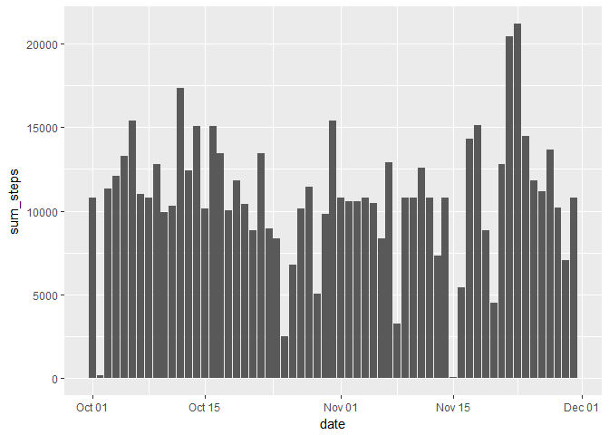

# Reproducible Research: Peer Assessment 1
##firstly
I spent most of my time coding and trying to satisfy the assignment not designing aesthetics for the charts. thanks for looking.

## Loading and preprocessing the data
Here we'll download and load the data and any packages used. also we'll run analysis on the data to get desired results.  I like using code that will download the data itself.

```r
library(ggplot2)
```

```
## Warning: package 'ggplot2' was built under R version 3.4.1
```

```r
library(dplyr)
```

```
## Warning: package 'dplyr' was built under R version 3.4.1
```

```
## 
## Attaching package: 'dplyr'
```

```
## The following objects are masked from 'package:stats':
## 
##     filter, lag
```

```
## The following objects are masked from 'package:base':
## 
##     intersect, setdiff, setequal, union
```

```r
#file url and download and unzip
fileUrl <-"https://d396qusza40orc.cloudfront.net/repdata%2Fdata%2Factivity.zip"
if (!file.exists("./RepData_PeerAssessment1.zip")) {
        mydir<- paste0(getwd(),"/","RepData_PeerAssessment1.zip")
        download.file(fileUrl, destfile = mydir)
        unzip("./RepData_PeerAssessment1.zip")
}
#reading in data
act_data<- read.csv("activity.csv")
#grouping data by day
grp_day<-group_by(act_data, date)
#group by interval
grp_interval<-group_by(act_data, interval)
#summarise grouped day data by total steps taken per day
day_data<-summarise(grp_day, sum_steps = sum(steps))
#summarise steps by interval group already took care of some na's here
interval_data<-summarise(grp_interval, average_steps = mean(steps, na.rm = TRUE))
#changing date column to date format
day_data$date<- as.Date(as.character(day_data$date, format = "%Y%m%d"))
```
## What is mean total number of steps taken per day?
Here we'll plot total steps taken per day as a **HISTOGRAM**
and also run summary statistics to get values including mean and median of the sum of steps per day

```r
#plot histogram, stat = "identity" is key here for hist plot to work
ggplot(day_data)+geom_histogram(aes(x=date, y=sum_steps),stat = "identity")
```

```
## Warning: Ignoring unknown parameters: binwidth, bins, pad
```

```
## Warning: Removed 8 rows containing missing values (position_stack).
```

<!-- -->

```r
#run summary stats on sum steps
summary(day_data$sum_steps)
```

```
##    Min. 1st Qu.  Median    Mean 3rd Qu.    Max.    NA's 
##      41    8841   10765   10766   13294   21194       8
```
## What is the average daily activity pattern?
Here We'll plot a line graph of the average steps for each interval across all days. we'll include the values of the the interval and average steps with the maximum number of average steps.

```r
qplot(interval, average_steps, data = interval_data, geom = "line", xlab = "Intervals across all days")
```

<!-- -->

```r
c(paste("Interval with max average value is", interval_data[which.max(interval_data$average_steps),][[1]]),
        paste("Max average value is", interval_data[which.max(interval_data$average_steps),][[2]]))
```

```
## [1] "Interval with max average value is 835"
## [2] "Max average value is 206.169811320755"
```
## Imputing missing values
Let's go ahead and look for any NA's and report them. then we'll replace na's for a specific day with the mean of the data set. we'll use this appended data set to create a new histogram and summary similar to the first.

```r
paste("Number of NA's is",sum(is.na(act_data)))
```

```
## [1] "Number of NA's is 2304"
```

```r
#find which is na and assign a new value thats the mean of the set
day_data$sum_steps[which(is.na(day_data$sum_steps))]<-mean(day_data$sum_steps, na.rm = TRUE)
#plot histogram, stat = "identity" is key here for hist plot to work
ggplot(day_data)+geom_histogram(aes(x=date, y=sum_steps),stat = "identity")
```

```
## Warning: Ignoring unknown parameters: binwidth, bins, pad
```

<!-- -->

```r
#run summary stats on sum steps
summary(day_data$sum_steps)
```

```
##    Min. 1st Qu.  Median    Mean 3rd Qu.    Max. 
##      41    9819   10766   10766   12811   21194
```

## Are there differences in activity patterns between weekdays and weekends?
This part was easily the hardest for me... but what i did here was remove all the na's from steps in the original data frame and replace them with the **median values not mean**. then added weekday names to the data frame and evaluated them to be either weekends or weekdays. finally i somehow managed to use ggplot to both plot and run the necessary stats.

```r
#replace na's with median values
act_data$steps[which(is.na(act_data$steps))]<-median(act_data$steps, na.rm = TRUE)
#firstly chang the date format to "date" from "factor"
act_data$date<- as.Date(as.character(act_data$date, format = "%Y%m%d"))
#adding a weekday factor column
act_data$day<-as.factor(weekdays(act_data$date))
#setting the order of the levels of that column
act_data$day <- factor(act_data$day, levels = c("Monday", "Tuesday", "Wednesday","Thursday","Friday", "Saturday", "Sunday"))
#adding a factor column of weekend or weekdays
act_data$wkendday<- as.factor(ifelse(act_data$day %in% c("Saturday", "Sunday"), "weekend", "weekday"))
#ploting the means of means of steps taken by interval by weekday and weekend
ggplot(act_data, aes(x=interval, y=steps))+ stat_summary(fun.y = "mean", geom = "line")+ facet_grid(.~wkendday)
```

<!-- -->


